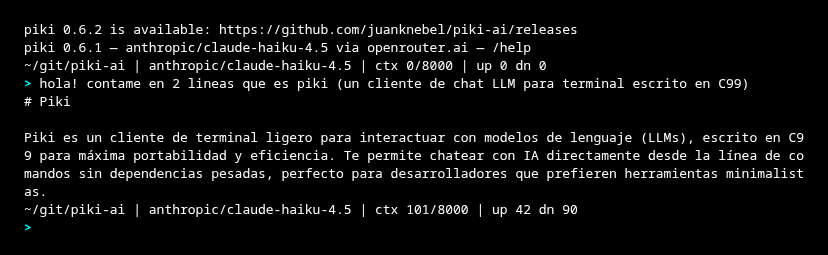
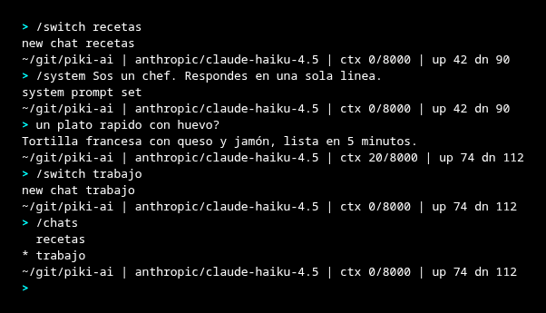
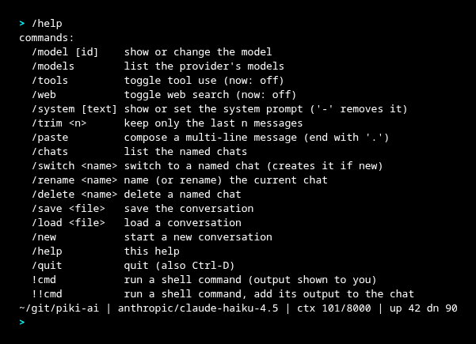
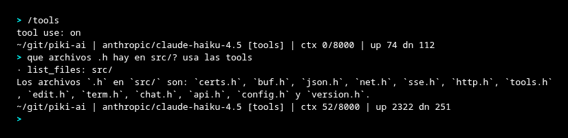
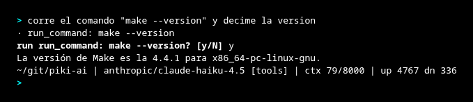

# piki

A chat client for LLM models for the terminal, **ultra-lightweight and with
no runtime dependencies**. Designed to run anywhere, including old 32-bit
laptops (Linux i686) and Haiku OS. Verified on real hardware: an Acer
Aspire One 32-bit netbook with 1 GB of RAM.

Talks to any OpenAI-compatible API endpoint: OpenRouter (by default) and
local servers like **Ollama** or **llama.cpp** (`llama-server`).

- Written in C99. Only build dependency: OpenSSL (for TLS).
- Release binaries are **static** (musl + embedded OpenSSL): a single
  file that you copy and run, with nothing to install.
- CA certificates embedded in the binary — works even on systems whose
  certificate store has grown old.
- Streaming responses token by token; `Ctrl-C` cancels without closing the
  program.
- Line editor with history, optional tool use (read/write files, run
  commands with confirmation), and save/load conversations.



## Install (prebuilt binary)

Download the latest release with `curl`, make it executable, and put it in
your `PATH`:

```sh
# Linux 64-bit
curl -fLO https://github.com/juanknebel/piki-ai/releases/latest/download/piki-linux-x86_64
chmod +x piki-linux-x86_64
mv piki-linux-x86_64 ~/.local/bin/piki   # or /usr/local/bin/piki

# Linux 32-bit (i686)
curl -fLO https://github.com/juanknebel/piki-ai/releases/latest/download/piki-linux-i686

# Haiku x86-64 (needs `pkgman install openssl3` first)
curl -fLO https://github.com/juanknebel/piki-ai/releases/latest/download/piki-haiku-x86_64
```

To fetch a specific version instead of the latest, replace
`latest/download` with `download/vX.Y.Z`.

## Build

### Requirements

For the development build (compiled natively, links against the system
OpenSSL) you need:

- A C99 compiler (`gcc` or `clang`) and `make`.
- OpenSSL headers and libraries (`libssl` + `libcrypto`), version 1.1.1 or 3.x.
- The `openssl` CLI and a system CA bundle (`/etc/ssl/cert.pem`): the build
  generates `src/certs.h` from it once, via `tools/mkcerts.sh`.

Only the static release build (`make release`) additionally needs `perl`
(OpenSSL's `Configure`), `musl-gcc`, and the `i686-linux-musl` cross
toolchain — none of that is required to compile and run natively.

**Void Linux** (i686 or x86_64, glibc or musl):

```sh
sudo xbps-install -S base-devel openssl-devel ca-certificates
```

**Slackware** — a full install already includes everything (gcc, make,
openssl, ca-certificates). On a minimal install:

```sh
sudo slackpkg install gcc make binutils openssl ca-certificates
```

**Debian/Ubuntu**: `build-essential libssl-dev ca-certificates openssl` ·
**Arch**: `base-devel openssl ca-certificates` ·
**Fedora**: `gcc make openssl-devel ca-certificates openssl`

### Development build (dynamic, uses the system OpenSSL)

```sh
make           # produces build/piki
make test      # runs all suites (normal + AddressSanitizer)
```

### Static release build (musl + static OpenSSL)

```sh
make release   # produces dist/piki-linux-x86_64 and dist/piki-linux-i686
```

The first `make release` compiles OpenSSL for each architecture (it gets
cached in `deps/`); subsequent ones take seconds. Requires the tarballs
in `deps/` (see `tools/build-release.sh`).

On **Haiku** the build is native: `pkgman install openssl3_devel`, then
`make` (the `-lnetwork` is added automatically).

## Configuration

`~/.config/piki/config` (or `$XDG_CONFIG_HOME/piki/config`):

```ini
[provider "openrouter"]
url = https://openrouter.ai/api/v1
key = sk-or-...

[provider "ollama"]
url = http://192.168.1.10:11434/v1    ; no key: plain HTTP, no auth

[defaults]
provider = openrouter
model = anthropic/claude-haiku-4.5
system = Answer in English.
max_history = 40           ; messages sent per turn
max_memory = 256           ; KB of history kept in RAM
max_context_tokens = 8000  ; rough cap on what is sent per turn
check_updates = 1          ; 0 disables the daily release check
```

`max_memory` and `max_context_tokens` are two different limits.
`max_memory` caps what is **kept in RAM**: once past it the oldest messages
are dropped and freed, so a long session cannot grow without bound (on a
1 GB machine that is the difference between working and swapping).
`max_context_tokens` caps what is **sent** each turn, which bounds cost and
upload time; there is no tokenizer, so it is estimated at ~4 bytes per token.

Environment variables (override the config):

- `OPENROUTER_API_KEY` — key for the `openrouter` provider.
- `PIKI_BASE_URL` — alternative endpoint, e.g. `http://host:11434/v1`.

## Usage

```sh
piki                       # interactive REPL
piki "capital of France?"      # one-shot and exit
piki -m openai/gpt-4o-mini "hi"
piki -p ollama -m llama3.2 "hi"
piki -t "list the .c files in the current directory"   # with tool use

# local model on another machine on the LAN:
PIKI_BASE_URL=http://192.168.1.10:11434/v1 piki -m llama3.2 "hi"
```

Options: `-m model`, `-p provider`, `-s system_prompt`, `-t` (tool use),
`-w` (web search), `--resume`, `--version`, `--help`.

### Sessions

The REPL saves the conversation after every turn to
`~/.config/piki/session.json`, so a crash or a power cut does not lose it.
`piki --resume` continues that last conversation; without the flag it always
starts fresh (resuming is never automatic). If saving fails it warns once and
the chat carries on. For conversations you want to keep around, use the
explicit `/save <file>` and `/load <file>`.

For several conversations in parallel, name them: `/switch errands` saves the
chat you are leaving and opens (or creates) the chat `errands`, `/chats`
lists them (`*` marks the active one), `/rename` names the current one and
`/delete` removes one. Named chats live in `~/.config/piki/chats/`, one JSON
file each, and autosave after every turn just like the session.



### Update check

On startup the REPL mentions, in one dim line, when a newer release exists
on GitHub. The check never slows anything down: a detached background
process asks the GitHub API at most once a day and caches the answer in
`~/.config/piki/latest-release`; the notice comes from that cache. With no
internet connection nothing is shown and nothing waits. Disable it with
`check_updates = 0` in the `[defaults]` section of the config.

### Web search

`-w` (or `/web` in the REPL) enables OpenRouter's web-search plugin, so the
model can answer with up-to-date information. When active, the REPL prompt
changes to `web>` and the banner shows `[web]`. Web search is billed
separately by OpenRouter. Equivalent to appending `:online` to the model
slug (e.g. `-m anthropic/claude-haiku-4.5:online`), which also works without
the flag.

![the web> prompt and the [web] tag](screenshots/06-web.png)

### REPL commands

```
/model [id]         show or change the model
/model save         save the current model as default (writes ~/.config/piki/config)
/model <id> save    change to <id> and save it as default
/default [id]       alias for /model save
/models             list the provider's models
/tools              enable/disable tool use
/web                enable/disable web search
/system [text]      show or set the system prompt ('-' removes it)
/trim <n>           keep only the last n messages (shrinks the context)
/paste              compose a multi-line message (end with a single '.' line)
/chats              list the named chats
/switch <name>      switch to a named chat (creates it if new)
/rename <name>      name (or rename) the current chat
/delete <name>      delete a named chat
/save <file>        save the conversation (JSON)
/load <file>        load a conversation
/new                start a new conversation
/help               help
/quit               exit (also Ctrl-D)
!cmd                run a shell command (output shown to you)
!!cmd               run a shell command and add its output to the chat
```

` /model save` (or `/default`) persists the model to `[defaults] model = ...` in
`~/.config/piki/config` so it becomes the default for future sessions; it
preserves existing providers and other `[defaults]` keys and creates the file
if missing.



`!cmd` is a local shell escape — handy to check something without leaving the
REPL. `!!cmd` additionally feeds the command's output (stdout + stderr, with
its exit code) into the conversation, so you can then ask the model about it
(e.g. `!!make 2>&1` then "why does it fail?").

Line editing: ←/→ arrows, Home/End, ↑/↓ for history, Tab to complete
commands, Ctrl-A/E/K/U/W. History persists in `~/.config/piki/history`.

Above each prompt a status line shows the current directory, the active
model, which modes are on, how full the context is, and the session token
totals (`up` = prompt/sent, `dn` = completion/received):

```
~/git/piki-ai | claude-haiku-4.5 [tools] [web] | ctx 1208/8000 | up 1234 dn 567
```

`[tools]` and `[web]` appear only while those modes are enabled, so you can
always tell at a glance whether the model is allowed to touch your files or
search the web. `ctx` is the estimated size of the conversation against
`max_context_tokens`, so you can see truncation coming and start a `/new`
(or `/trim`) before older messages get dropped; it turns yellow at 75% and
red at 90% of the budget.

The line always fits on one row: on a narrow terminal it drops the model's
vendor prefix, then shortens the path, then hides the context gauge, rather
than wrapping and eating a second row of an 80x25 console. Token counts come
from the provider's usage accounting (OpenRouter reports them). When a
provider does not report usage (some local servers), the counts are estimated
at ~4 bytes per token and shown with a leading `~` (`up ~1234 dn ~567`) to
tell them apart from real numbers.

### Tool use

With `-t` (or `/tools` in the REPL) the model can request:

Read-only, run without asking:

- `read_file` — read a file.
- `list_files` — list a directory.
- `search_files` — literal substring search (not a regex) in a file or
  recursively in a directory, skipping hidden and binary files.

Modify the system, always ask for your `y/N` first:

- `edit_file` — replace a piece of text. The text to replace must appear
  exactly once, otherwise the edit is refused and the model is told to quote
  more context. Preferred over `write_file` for existing files: fewer tokens
  and no risk of mangling the rest.
- `write_file` — write/overwrite a whole file.
- `run_command` — run a shell command.





Requires a model with function calling support. Note that file contents are
untrusted input: a repository could contain text trying to steer the model,
which is why nothing can be written or executed without your confirmation.

## Structure

```
src/buf     dynamic buffer        src/sse     Server-Sent Events parser
src/net     TCP + TLS (OpenSSL)   src/api     OpenAI-compatible layer + agent
src/http    HTTP/1.1 + chunked    src/chat    history + context window
src/json    JSON parser/writer    src/config  INI file
src/edit    line editor           src/term    line reading
src/tools   agent tools
tools/mkcerts.sh        generates src/certs.h (embedded CA roots)
tools/build-release.sh  static builds with musl
```

Everything with the C standard library plus OpenSSL; HTTP, JSON, SSE and the
chunked encoding parser are our own.

## Author

Juan Knebel — juanknebel@gmail.com ·
<https://github.com/juanknebel/piki-ai>

## License

GPL-2.0. See [LICENSE](LICENSE).
